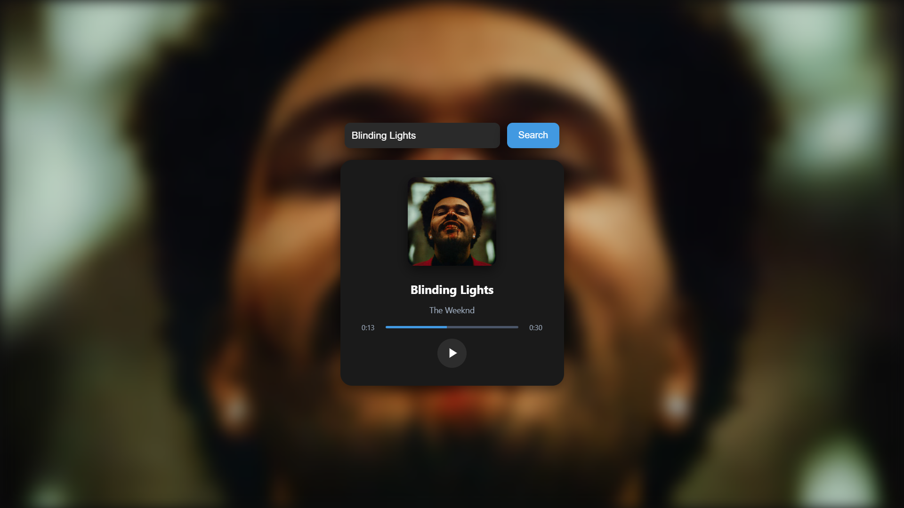

# 🎵 Music Player

A modern, responsive web music player built with HTML, CSS, and JavaScript, integrating the [Deezer API](https://rapidapi.com/deezerdevs/api/deezer-1) to search tracks, stream 30-second previews, and dynamically generate a blurred background from the album cover.



---

## ✨ Features

- 🔍 **Search songs** via Deezer API  
- 🎶 **Stream previews** (30 seconds) directly in browser  
- 🖼 **Dynamic blurred background** based on album artwork  
- 📱 **Responsive design** for desktop and mobile  
- ⚡ **Simple, lightweight & fast** (Vanilla JS, no frameworks)

---

## 📦 Project structure

deezer-music-player/
├── index.html # Main HTML file
├── style.css # CSS styles
├── script.js # JavaScript logic
└── README.md # Project documentation

---

## 🚀 Getting Started

1. **Clone the repository**
   ```bash
   git clone https://github.com/yourusername/deezer-music-player.git
   cd deezer-music-player
2. Install dependencies
  (No dependencies required — pure HTML/CSS/JS)

3. Obtain API Key

  Sign up at RapidAPI.

  Subscribe to the Deezer API.

  Copy your x-rapidapi-key.

4. Configure API Key

  Open script.js

  Replace the placeholder:

  xhr.setRequestHeader("x-rapidapi-key", "YOUR_API_KEY_HERE");

5. Run the app

Open index.html in your browser.

## 🛠 Built With
HTML5

CSS3

JavaScript (Vanilla)

Deezer API

---

## ✏️ Customization Ideas
Smooth fade animation on background change

Dark/light theme toggle

Display multiple search results instead of first track only

Deploy to GitHub Pages / Netlify

---

## 🙋‍♂️ Author
Surya Pratap Singh

GitHub: @Surya821

LinkedIn: Surya Pratap Singh
